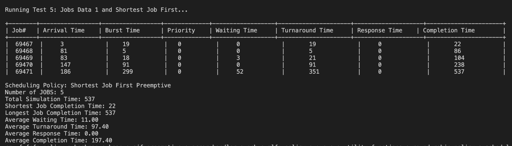

[Link to Youtube](https://youtu.be/kuxQ3QVEfbI)


# CPU Process Scheduling Simulation

## Input Format

The input format for the simulator is a text file which contains information about each process. The information include the Arrival Time and Burst Time. 

Each line within the input text will represent information about one job and it will follow the following format:

Arrival time : Burst time

Example input:
* 0:17
* 3:10
* 1:20

The above Describes a simulation that has three jobs.

The first job has an arrival time of 0 (when the simulation starts), it needs to do 17 clock ticks of work.

The program can be run with three command line arguments:
- The job file which contains a list of jobs, their arrival time and burstime. The format of the job file is discussed above.
- The second command line argument denotes the scheduling algorithm to use. 1 = FCFS, 2 = RR, 3 = SJF Preemptive and 4 = MLFQ.
- The third command line argument is optional, it represents the quantum that should be used by the round robin algorithm.

## How to run the program

The program can either be run manually or automatically

### Manually

- make all
- ./program <jobfile.txt> <Algorithm (1, 2, 3 or 4)> <quantum (if required)>
- make clean

### Automatic Run

The program contains a test.sh file which contains predefine automated tests that will allow the user to easily test the program. Each of the test can be seen in test.sh.
To run each test, run the commnd:

 ```bash
 chmod +x test.sh
 ./test.sh test<test number> 
 ./test.sh test5

 ```


 ## Sample Output

 


